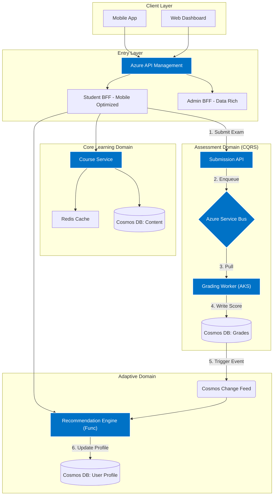
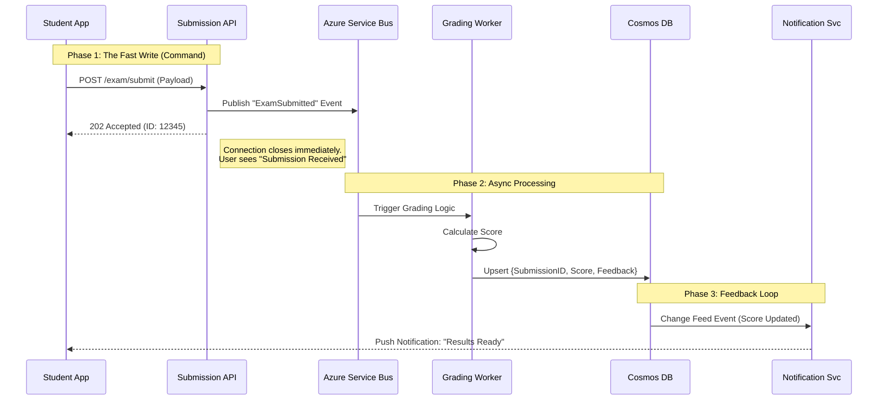

https://moonhome.agency/cloud_presentation

Here is a deep-dive investigation into the **Modernization Goals** and **Domain Model Design**. 
This document expands on the rationale, technical implementation strategies, and specific 
architectural patterns required to meet the scale of 5 million+ students.

---

# Part 1: Deep Dive – Modernization Goals & Success Criteria

Moving from a monolith to microservices is not just about changing code; it is about changing how the system handles stress, data, and evolution. Below is a detailed breakdown of the strategic goals and the specific metrics used to measure success.

## 1.1 Goal: Hyper-Elastic Scalability (The "Exam Day" Problem)
**Challenge:** Traditional autoscaling (CPU-based) is too reactive for exams. By the time CPU spikes, the queue is already backed up, causing timeouts for students trying to submit answers.
**Strategy:**
*   **Event-Driven Autoscaling (KEDA):** Implement Kubernetes Event-Driven Autoscaling (KEDA) on Azure AKS. Instead of scaling based on CPU, we scale based on the **depth of the Azure Service Bus queue**.
*   **Predictive Scaling:** Use Azure Monitor + GenAI to analyze historical traffic patterns (e.g., "Physics 101 Finals typically trigger 50k requests at 9:00 AM") and pre-warm the infrastructure.

**Success Criteria:**
*   **Metric:** **Time-to-Scale.** The system must scale from 10 pods to 500 pods in under 2 minutes.
*   **Metric:** **Error Rate.** $< 0.01\%$ HTTP 503 (Service Unavailable) errors during peak concurrency (100k concurrent users).

## 1.2 Goal: Strict Multi-Tenancy & Data Sovereignty
**Challenge:** Large institutional clients (Universities/Governments) require guarantees that their data is isolated from others.
**Strategy:**
*   **Hybrid Isolation Model:**
    *   *Tier 1 (Standard):* Logical isolation. Data lives in shared containers but is strictly separated by `TenantID` partition keys in Cosmos DB.
    *   *Tier 2 (Enterprise):* Physical isolation. Dedicated Cosmos DB containers or Databases for high-paying institutional tenants.
*   **GenAI Identity Validation:** A specialized AI agent runs continuous "Red Team" attacks against the API, attempting to access Tenant A’s data using Tenant B’s tokens to validate isolation rules.

**Success Criteria:**
*   **Metric:** **Cross-Tenant Leakage.** 0 incidents of cross-tenant data access.
*   **Metric:** **Tenant Cost Visibility.** Ability to generate a per-tenant cost report (Compute + Storage) with 95% accuracy for billing purposes.

## 1.3 Goal: Real-Time "Feedback Loop" (Personalization)
**Challenge:** Current adaptive learning is batched. Students wait 24 hours to get recommendations based on a quiz they took today.
**Strategy:**
*   **Stream Processing:** Move from batch jobs to **Azure Functions** triggered by **Cosmos DB Change Feed**.
*   **Workflow:** Student submits answer $\rightarrow$ DB Update $\rightarrow$ Change Feed Event $\rightarrow$ Recommendation Function calculates next content $\rightarrow$ Push Notification to Student.

**Success Criteria:**
*   **Metric:** **Data Freshness.** The recommendation engine reflects a student's latest activity within **< 3 seconds**.

---

# Part 2: Domain Model & Service Map Design

We will utilize **Domain-Driven Design (DDD)** to define Bounded Contexts. This prevents the "Distributed Monolith" anti-pattern where services are too chatty.

## 2.1 The Bounded Contexts (Service Map)

We have identified four primary domains. Each domain manages its own data and scaling requirements.

### 1. Core Learning Domain (Read-Heavy)
*   **Responsibility:** Management of Syllabus, Videos, PDFs, and static content.
*   **Microservices:** `Course Catalog Service`, `Content Delivery Service`.
*   **Database:** Azure Cosmos DB (Document Model) + Azure Blob Storage.
*   **Characteristics:** High Read/Write ratio (1000:1). Heavily cached via Redis.

### 2. Assessment Domain (Write-Intensive)
*   **Responsibility:** Quizzes, Exams, Code Compilation, Grading.
*   **Microservices:** `Submission Service`, `Grading Worker`, `Results Service`.
*   **Database:** Azure Cosmos DB (Write-optimized).
*   **Characteristics:** Extremely "bursty" traffic. Requires **CQRS pattern** (detailed below).

### 3. Adaptive Domain (Compute-Intensive)
*   **Responsibility:** Analyzing performance to recommend content.
*   **Microservices:** `Recommendation Engine` (Serverless Functions).
*   **Database:** Azure Cosmos DB (Graph or Gremlin API could be used here for relationship mapping, or standard NoSQL).

### 4. Identity & Governance Domain
*   **Responsibility:** Auth, Tenant Management, RBAC.
*   **Microservices:** `Tenant Manager`, `Identity Provider (B2C)`.

---

## 2.2 Detailed Architecture Diagrams

### Diagram A: The System Context & Data Flow
This diagram illustrates how the different domains interact via the BFF (Backend for Frontend) and Event Bus.

### Diagram B: The CQRS Pattern for Assessment
The most critical bottleneck is the **Exam Submission**. If 500,000 students submit at 10:00 AM, a standard REST API writing to a Relational DB will crash.

**The Solution:** Command Query Responsibility Segregation (CQRS).

1.  **Command (Write):** The API only accepts the data and puts it in a queue. It does *not* process it. Response time: 20ms.
2.  **Async Processing:** Workers pick up the exam, run auto-grading algorithms, and write to the database.
3.  **Query (Read):** The database projects the data into a "Read View" for the frontend to display.

---

## 2.3 Architectural Decisions & Rationale

### Decision 1: Backend-for-Frontend (BFF)
*   **Why?** Mobile devices often have unstable connections.
*   **Implementation:** The `Student BFF` performs **Request Aggregation**. Instead of the mobile app making 3 calls (Get Profile, Get Courses, Get Recommendations), it makes 1 call to the BFF. The BFF calls the 3 microservices internally (on the high-speed Azure backbone) and returns a single JSON response.

### Decision 2: Cosmos DB over SQL
*   **Why?**
    1.  **Schema Evolution:** EdTech content structures change frequently (e.g., adding "Interactive Labs" to a course structure). NoSQL allows this without downtime for schema migrations.
    2.  **Elasticity:** Cosmos DB offers instant throughput scaling, essential for the "Thundering Herd" of exam traffic.
*   **Partitioning Strategy:**
    *   *Course Container:* Partition Key = `/CourseCategory` (Good for read filtering).
    *   *Submission Container:* Partition Key = `/ExamID` (Ensures all submissions for one exam are grouped for analytics, but might need synthetic keys if one exam is too hot). *Revised Recommendation:* Use `/TenantID_ExamID` to balance load.

### Decision 3: Azure Functions for Recommendations
*   **Why?** Recommendations are sporadic. A student might finish a quiz at 3 AM. Running a dedicated container 24/7 for this is wasteful.
*   **Implementation:** Serverless functions cost nothing when idle and scale infinitely when thousands of results come in simultaneously via the Change Feed.

---

## 2.4 Extended Deployment Diagram (Infrastructure)

To visualize how this maps to Azure infrastructure:

*   **Network Security:** All resources (AKS, Cosmos, Redis) are inside an **Azure Virtual Network (VNet)**.
*   **Ingress:** **Azure Application Gateway (WAF)** sits in front of APIM to provide SSL termination and protection against DDoS/SQL Injection.
*   **Storage:**
    *   **Hot:** Redis (Session data, Leaderboards).
    *   **Warm:** Cosmos DB (User data, Courses).
    *   **Cold:** Azure Data Lake Storage Gen2 (Archived logs, historic exam attempts for GenAI training).

### GenAI Integration in Observability
A generic "Monitoring Service" is insufficient. We will implement an **AI-Ops Agent**:
1.  **Log Ingestion:** Feeds Application Insights logs into an Azure OpenAI model.
2.  **Pattern Recognition:** "Warning: Microservice 'Grading' latency increases by 200ms whenever 'Video Service' throughput drops. Potential dependency timeout."
3.  **Self-Healing:** The AI can trigger a logic app to restart a specific pod or scale a specific node pool based on these complex heuristics.
